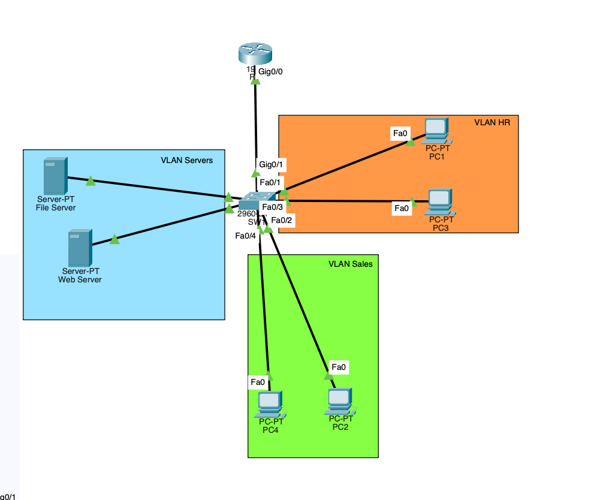
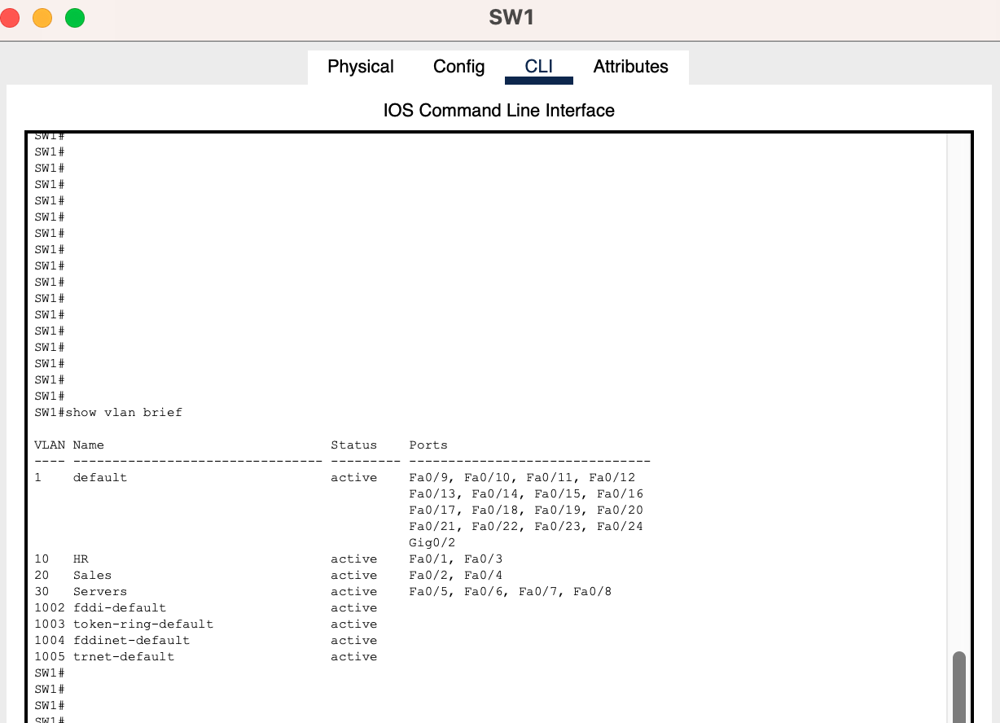
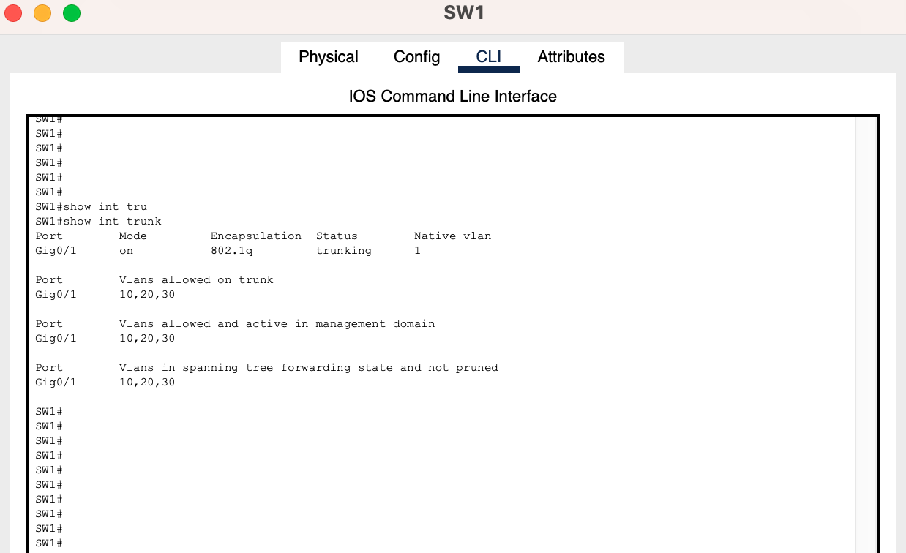
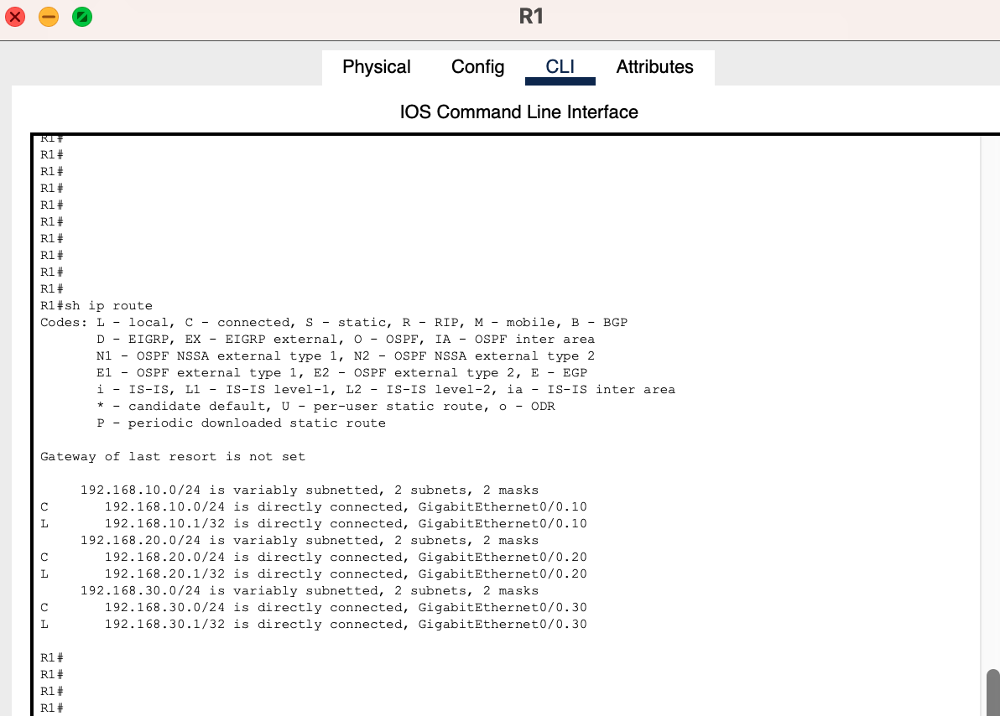
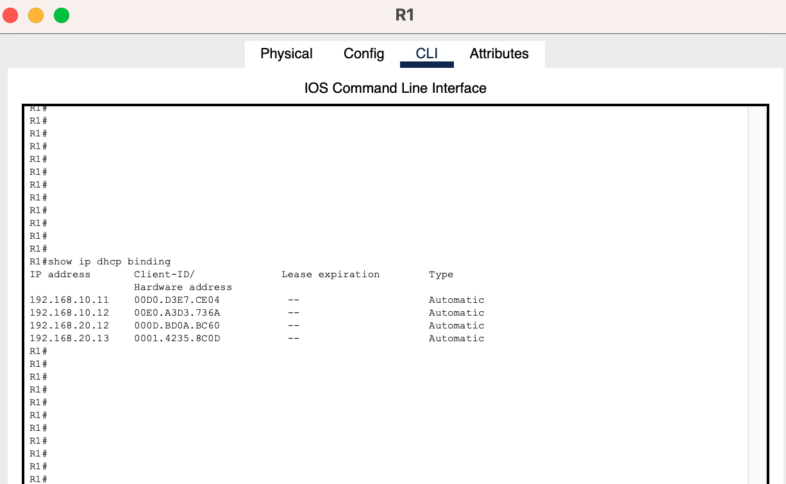
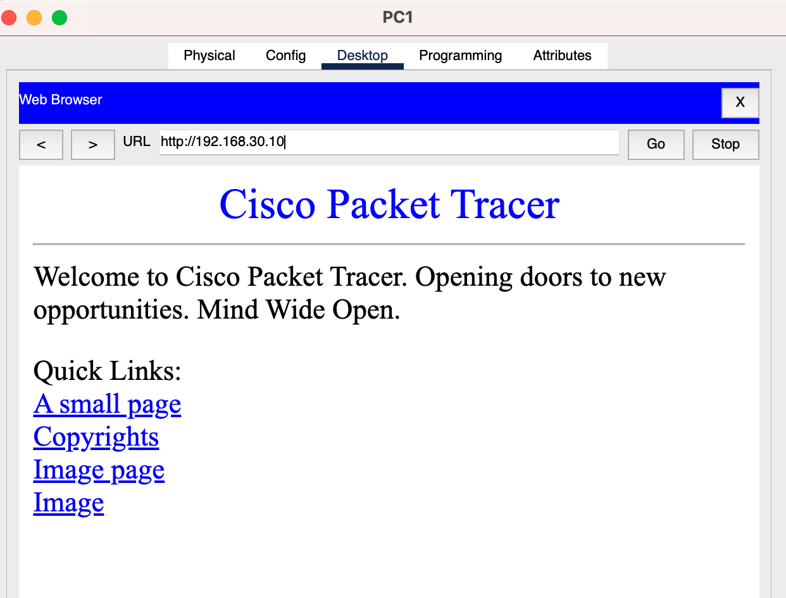
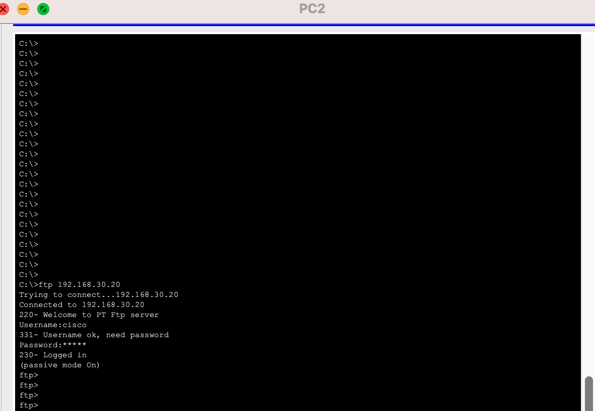
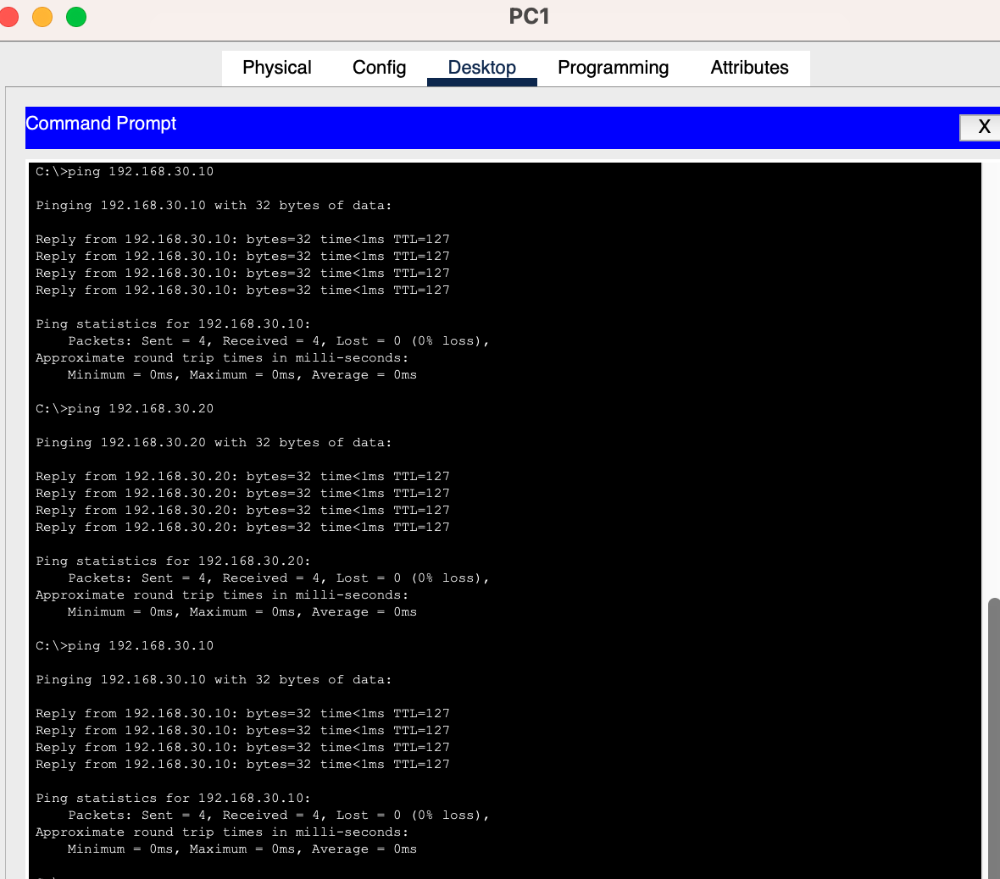

# vlan-router-on-a-stick-dhcp-lab
Cisco Packet Tracer lab - VLANs, Router-on-a-Stick, DHCP, Web &amp; FTP Servers

# VLANs + Router-on-a-Stick with DHCP and Server Services

Cisco Packet Tracer lab demonstrating **VLAN segmentation**, **Router-on-a-Stick inter-VLAN routing**, **DHCP server**, and hosting **Web + FTP services**.

## Topology

## VLAN & IP Addressing Scheme

| VLAN | Name      | Subnet              | Gateway         | Devices                     |
|------|-----------|---------------------|-----------------|-----------------------------|
| 10   | HR        | 192.168.10.0/24     | 192.168.10.1    | PC1, PC3                    |
| 20   | Sales     | 192.168.20.0/24     | 192.168.20.1    | PC2, PC4                    |
| 30   | Servers   | 192.168.30.0/24     | 192.168.30.1    | Web Server, File Server     |

## Features Implemented
- 802.1Q Trunking
- Router-on-a-Stick (subinterfaces)
- DHCP pools for each VLAN
- Web Server (HTTP) and FTP Server in VLAN 30

## Verification

**Configuration & Routing**

**Services Testing**

**Connectivity**

## Skills Demonstrated
- VLAN configuration and trunking
- Router-on-a-Stick inter-VLAN routing
- DHCP server with multiple pools
- Network services (HTTP & FTP)
- Full network verification

## How to Use
1. Open `roas-vlan-dhcp-lab.pkt`
2. Load configs from `configs/` folder
3. Access Web Server: `http://192.168.30.10`
4. Access FTP: `192.168.30.20` (Username: `cisco` / Password: `cisco`)

---

**Last updated:** April 2026
