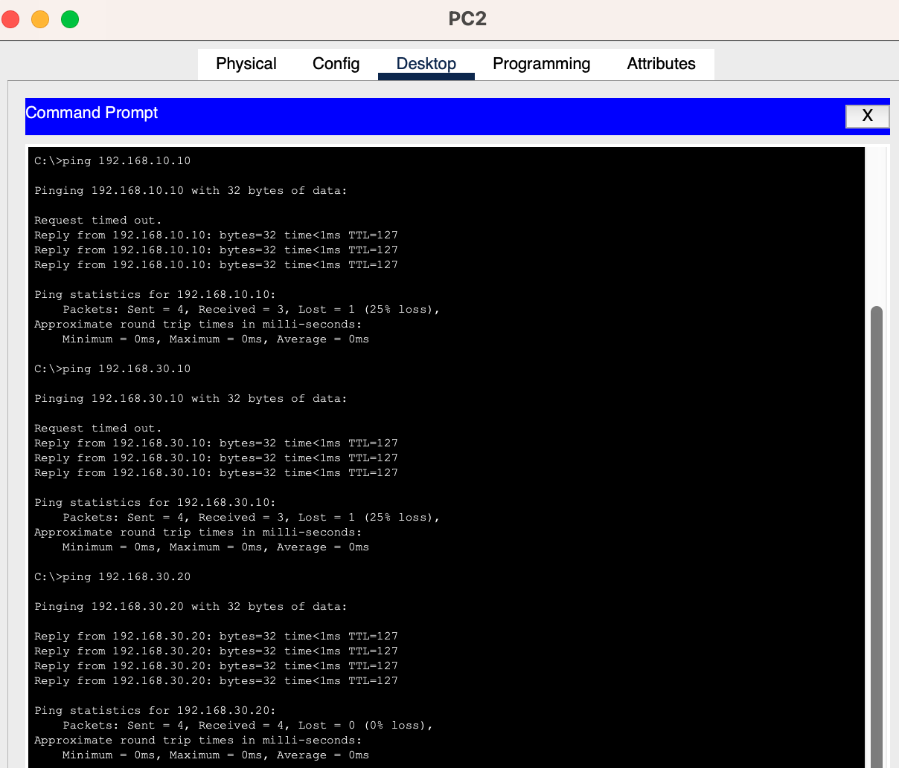
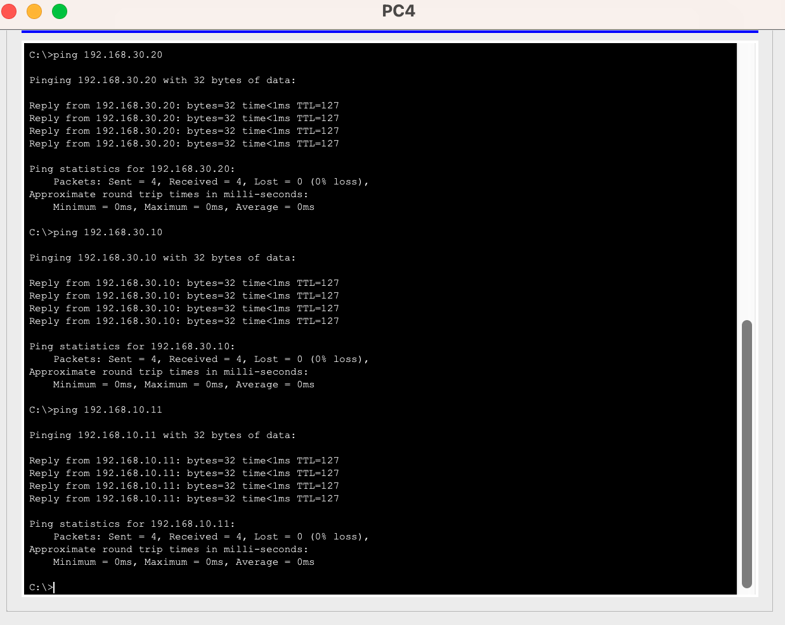

# VLANs + Router-on-a-Stick with DHCP and Server Services

Cisco Packet Tracer lab demonstrating **VLAN segmentation**, **Router-on-a-Stick inter-VLAN routing**, **DHCP server**, and hosting **Web + FTP services** in a multi-VLAN environment.

## Topology

## VLAN & IP Addressing Scheme

| VLAN | Name     | Subnet              | Gateway           | Devices                     |
|------|----------|---------------------|-------------------|-----------------------------|
| 10   | HR       | 192.168.10.0/24     | 192.168.10.1      | PC1, PC3                    |
| 20   | Sales    | 192.168.20.0/24     | 192.168.20.1      | PC2, PC4                    |
| 30   | Servers  | 192.168.30.0/24     | 192.168.30.1      | Web Server, File Server     |

## Features Implemented
- 802.1Q Trunking
- Router-on-a-Stick (subinterfaces with `encapsulation dot1Q`)
- DHCP pools for each VLAN
- Web Server (HTTP) and FTP Server in VLAN 30

## Verification

### Configuration & Routing

### Services Testing

### Connectivity

## Skills Demonstrated
- VLAN configuration and port assignment
- Trunking and Router-on-a-Stick technique
- DHCP server configuration with multiple pools
- Hosting and accessing network services (HTTP & FTP)
- Inter-VLAN routing and troubleshooting

## How to Use
1. Open `roas-vlan-dhcp-lab.pkt` in Cisco Packet Tracer
2. Load the configurations from the `configs/` folder
3. PCs will automatically obtain IPs via DHCP
4. Test Web Server: `http://192.168.30.10`
5. Test FTP Server: `192.168.30.20` (Username: `cisco` / Password: `cisco`)

---

**Last updated:** April 2026
